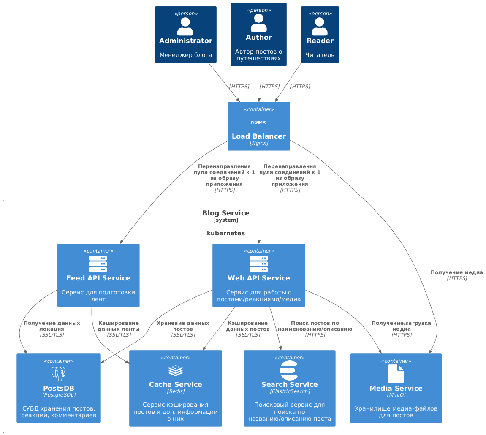
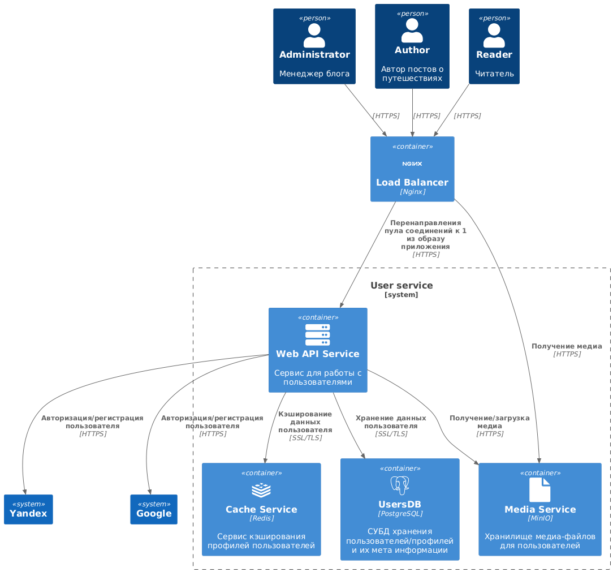

# Travel Social Network

System Design социальной сети для курса по [System Design](https://balun.courses/courses/system_design).

## Scope refinement:

 * публикация постов из путешествий с фотографиями, небольшим описанием и привязкой к конкретному месту путешествия;
 * оценка и комментарии постов других путешественников;
 * подписка на других путешественников, чтобы следить за их активностью;
 * поиск популярных мест для путешествий и просмотр постов с этих мест;
 * просмотр ленты других путешественников;

## Функциональные требования:

* Публикация постов:
  * Пользователи могут публиковать посты с фотографиями, небольшим описанием и привязкой к конкретному месту путешествия.
  * Поддержка геолокации для привязки постов к местам.
  * Возможность редактирования и удаления постов.

* Оценка и комментарии:
  * Пользователи могут ставить лайки и оставлять комментарии к постам других пользователей.

* Подписка на других пользователей:
  * Пользователи могут подписываться на других путешественников для отслеживания их активности.

* Поиск и просмотр популярных мест:
  * Возможность поиска популярных мест для путешествий.
  * Просмотр постов, связанных с конкретными местами.

* Лента активности:
  * Просмотр ленты постов от подписок и популярных постов.

## Нефункциональные требования:

#### Аудитория приложения 

* Количество пользователей: 10 000 000 DAU.
  * Поведение пользователей: 
    * Публикация постов, оценка и комментарии, подписка на других пользователей, поиск и просмотр постов.
    * Среднее количество просмотров пользователя в месяц:
      * Посты: `5 постов в день * 30 дней = 150`.
      * Загруженные фото к постам: `5 фото к посту * 5 постов * 30 дней = 750`.
      * Реакции идут вместе с данными поста.
      * Комментарии: `2 ком. к посту * 5 постов * 30 дней = 300`.
    * Среднее количество записи пользователя в месяц:
      * Публикация постов: `1 пост в неделю * 4 недель = 4`.
      * Загруженные фото к посту: `5 фото к посту * 4 поста * 4 недель = 80`.
      * Реакции: `1 реакция * 3 постов * 30 дней = 90`.
      * Комментарии: `2 ком. к посту * 2 постов * 4 недель = 16`.
 * Регионы использования приложения: `Только на СНГ`.

#### Особенности приложения 

 * Сезонности в приложении:
   * Повышенная активность во время летних и зимних каникул, праздников и выходных дней.
   * Повышенный активность в днях: `118 дней выходных/праздников + 64 дня летних каникул = 182 дня`.
   * Повышенный активность в часах: `с 6 до 9 утра и с 18 до 20 вечера`.
 * Условия хранения данных: `Храним всегда`.
 * Лимиты и ограничения:
   * Максимальный размер поста: `5 МБ`.
   * Максимальный размер фотографии: `2 МБ`.
   * Максимальное количество реакций на пост: `не ограничено`.
   * Максимальное количество комментариев на пост: `не ограничено`.
 * Временные ограничения:
   * Время ответа на запросы:
     * Публикация поста: `< 2 секунды`.
     * Загрузка ленты: `< 2 секунда`.
     * Загрузка фотографий: `< 3 секунда`.
     * Оценка и комментарии: `< 1 секунда`.
 * Доступность приложения: Не более, чем несколько часов простоя в год - `99,9%`.

## Оценка нагрузки

  * **MAU**: 10M * 30 = 300M
  * **DAU**: 10M

Предположим, что **на пользователя в месяц среднее количество запросов**:

| Сущность    | Month Read | Month Write |
|-------------|------------|-------------|
| Посты       | 150        | 4           |
| Фотографии  | 750        | 80          |
| Реакции     | -          | 90          |
| Комментарии | 300        | 16          |

Исходя из таблицы выше, предположим, что **общее количество запросов в день**: 

| Сущность    | Read                   | Write                 |
|-------------|------------------------|-----------------------|
| Посты       | 150 / 30 * 10M = 50M   | 4 / 30 * 10M = 1.3M   |
| Фотографии  | 750 / 30 * 10M = 250M  | 80 / 30 * 10M = 26.6M |
| Реакции     | -                      | 90 / 30  * 10M = 30M  |
| Комментарии | 300 / 30  * 10M = 100M | 16 / 30  * 10M = 5.3M |

#### Запросы (load)

**Posts**

$$Read=\frac{50.000.000}{86.400секунд}=578.7RPS$$

$$Write=\frac{1.300.000}{86.400секунд}=15.1RPS$$

**Media content**

$$Read=\frac{250.000.000}{86.400секунд}=2893.5RPS$$

$$Write=\frac{26.600.000}{86.400секунд}=307.8RPS$$

**Reactions**

$$Write=\frac{30.000.000}{86.400секунд}=347.2RPS$$

**Comments**

$$Read=\frac{100.000.000}{86.400секунд}=1157.4RPS$$

$$Write=\frac{5.300.000}{86.400секунд}=61.3RPS$$

#### Сетевая нагрузка

Предположим, что:
- **Размер одного поста**: 5 MB
- **Размер одной фотографии**: 2 MB
- **Размер одной реакции**: 50 байт
- **Размер одного комментария**: 600 байт

*Для сокращения расчетов с миллионами используется обозначение M: 150M = 150.000.000*

**Posts**

$$Read=150M/30дней/86400секунд×5MB=283.35\frac{MB}{секунду}$$

$$Write=4M/30дней/86400секунд×5MB=7.7\frac{MB}{секунду}$$

**Media content**

$$Read=750M/30дней/86400секунд×2MB=578.7\frac{MB}{секунду}$$

$$Write=80M/30дней/86400секунд×2MB=61.74\frac{MB}{секунду}$$

**Reactions**

$$Write=90M/30дней/86400секунд×50byte=1.7\frac{Kb}{секунду}$$

**Comments**

$$Read=300M/30дней/86400секунд×600byte=67.82\frac{Kb}{секунду}$$

$$Write=16M/30дней/86400секунд×600byte=3.62\frac{Kb}{секунду}$$

## Схемы:

Схемы в формате `.puml` расположены в папке `architecture`

#### Уровень контекста

#### Уровень контейнеров

| **Сервис постов**                                                 | **Сервис гео-кодирования**                                      | **Сервис пользователей**                                          |
|-------------------------------------------------------------------|-----------------------------------------------------------------|-------------------------------------------------------------------|
|  |  |  |