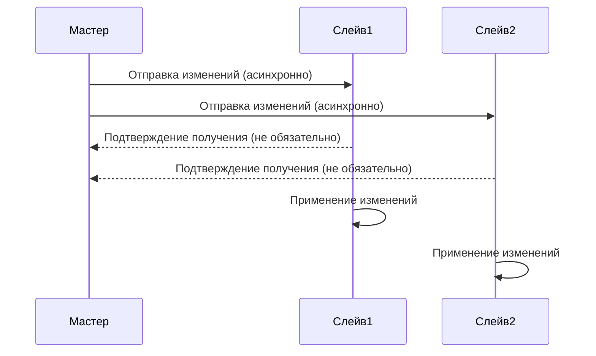

# Хранение данных

## Оглавление

1. [Модели данных](#модели-данных)
2. [Оценка дисков](#оценка-дисков)
    - [Данные для расчета](#данные-для-расчета)
    - [Posts](#posts)
    - [Media](#media)
    - [Reactions](#reactions)
    - [Comments](#comments)
    - [Итоговая оценка](#итоговая-оценка)
3. [Проектирование распределенного хранения данных](#проектирование-распределенного-хранения-данных)
4. [Оценка хостов](#оценка-хостов)

## Модели данных

* main - общая модель, с учетом всех связей
  
**Разбиение по БД:**
* geolocation - модель для хранения гео-данных
* users - модель для хранения данных пользователей и их подписок
* posts - модель для хранения постов и их данных(фото, реакции, комментарии)

Также будет осуществляться кэширование данных: `ID сущности`: `Данные сущности`

## Оценка дисков

### Данные для расчета

**Используемые формулы:**

* **Сapacity**: `traffic_per_second * 86 400 seconds * 365 days`
* **DfC** (Disks for capacity): `capacity / disk_capacity`
* **DfT** (Disks for throughput): `traffic_per_second / disk_throughput`
* **DfI** (Disks for iops): `iops / disk_iops`
* **Disks**: `max(ceil(Disks_for_capacity), ceil(Disks_for_throughput), ceil(Disks_for_iops))`

**Данные о дисках:**

|                                  | HDD        | SSD (SATA) | SSD (nVME) |
|----------------------------------|------------|------------|------------|
| Объем                            | до 32TB    | до 100TB   | до 30TB    |
| Пропускная способность           | 100 MB/sec | 500 MB/sec | 3 GB/sec   |
| Операции ввода-вывода в секунду  | 100        | 1 000      | 10 000     |
| Предполагаемая стоимость за диск | $100       | $300       | $500       |

**Предположительные данные о системе:**

|             | Capacity | Traffic                     | IOPs |
| ----------- | -------- | --------------------------- | ---- |
| Посты       | 8522 TB  | 292 MB/sec                  | 60   |
| Фотографии  | 19261 TB | 640.44 MB/sec               | 321  |
| Реакции     | 0.05 TB  | 1.7 Kb/sec = 0.00166 MB/sec | 35   |
| Комментарии | 2.11 TB  | 71.44 Kb/sec = 0.07 MB/sec  | 122  |

### Posts

#### HDD

$$DfC=\frac{8522TB}{32TB}=267$$

$$DfT=\frac{283.35MB/sec}{100MB/sec}=2.84$$

$$DfI=\frac{60}{100}=0.6$$

$$Discs=max(ceil(267), ceil(2.84), ceil(0.6))=267$$

#### SSD (SATA)

$$DfC=\frac{8522TB}{100TB}=85.22$$

$$DfT=\frac{283.35MB/sec}{500MB/sec}=0.57$$

$$DfI=\frac{60}{1000}=0.06$$

$$Discs=max(ceil(85.22), ceil(0.57), ceil(0.06))=86$$

#### SSD (nVME)

$$DfC=\frac{8522TB}{30TB}=284.06$$

$$DfT=\frac{283.35MB/sec}{3 * 1024MB/sec}=0.09$$

$$DfI=\frac{60}{10000}=0.006$$

$$Discs=max(ceil(284.06), ceil(0.09), ceil(0.006))=285$$

### Media

#### HDD

$$DfC=\frac{19261TB}{32TB}=602$$

$$DfT=\frac{640.44MB/sec}{100MB/sec}=6.4$$

$$DfI=\frac{321}{100}=3.21$$

$$Discs=max(ceil(602), ceil(6.4), ceil(3.21))=602$$

#### SSD (SATA)

$$DfC=\frac{19261TB}{100TB}=193$$

$$DfT=\frac{640.44MB/sec}{500MB/sec}=1.28$$

$$DfI=\frac{321}{1000}=0.321$$

$$Discs=max(ceil(193), ceil(1.28), ceil(0.321))=193$$

#### SSD (nVME)

$$DfC=\frac{19261TB}{30TB}=643$$

$$DfT=\frac{640.44MB/sec}{3*1024MB/sec}=0.21$$

$$DfI=\frac{321}{10000}=0.0321$$

$$Discs=max(ceil(643), ceil(0.21), ceil(0.0321))=643$$

### Reactions

#### HDD

$$DfC=\frac{0.05}{2TB}=0.025$$

$$DfT=\frac{0.00166MB/sec}{100MB/sec}=0.0000166$$

$$DfI=\frac{35}{100}=0.35$$

$$Discs=max(ceil(0.025), ceil(0.0000166), ceil(0.35))=1$$

#### SSD (SATA)

$$DfC=\frac{0.05}{2TB}=0.025$$

$$DfT=\frac{0.00166MB/sec}{500MB/sec}=0.00000332$$

$$DfI=\frac{35}{1000}=0.035$$

$$Discs=max(ceil(0.025), ceil(0.00000332), ceil(0.035))=1$$

#### SSD (nVME)

$$DfC=\frac{0.05}{2TB}=0.025$$

$$DfT=\frac{0.00166MB/sec}{3 * 1024MB/sec}=0.00000054$$

$$DfI=\frac{35}{10000}=0.0035$$

$$Discs=max(ceil(0.025), ceil(0.00000054), ceil(0.0035))=1$$

### Comments

#### HDD

$$DfC=\frac{2.11TB}{2TB}=1.055$$

$$DfT=\frac{0.07MB/sec}{100MB/sec}=0.0007$$

$$DfI=\frac{122}{100}=1.22$$

$$Discs=max(ceil(1.055), ceil(0.0007), ceil(1.22))=2$$

#### SSD (SATA)

$$DfC=\frac{2.11TB}{2TB}=1.055$$

$$DfT=\frac{0.07MB/sec}{500MB/sec}=0.00014$$

$$DfI=\frac{122}{1000}=0.122$$

$$Discs=max(ceil(1.055), ceil(0.00014), ceil(0.122))=2$$

#### SSD (nVME)

$$DfC=\frac{2.11TB}{2TB}=1.055$$

$$DfT=\frac{0.07MB/sec}{3 * 1024MB/sec}=0.0000228$$

$$DfI=\frac{122}{10000}=0.0122$$

$$Discs=max(ceil(1.055), ceil(0.0000228), ceil(0.0122))=2$$

### Итоговая оценка

| Подсистема    | HDD         | SSD (SATA)  | SSD (nVME)   |
|---------------|-------------|-------------|--------------|
| Посты         | 267         | 86          | 285          |
| Фотографии    | 602         | 193         | 643          |
| Реакции       | 1           | 1           | 1            |
| Комментарии   | 2           | 2           | 2            |
| **Итого**     | **872**     | **283**     | **932**      |
| **Стоимость** | **$87,200** | **$84,900** | **$466,000** |

* Для постов можно ограничиться SSD (SATA): 86 * $300 = $25800
* Для фотографий можно ограничиться SSD (SATA): 193 * $300 = $57900
* Для реакций и комментариев можно ограничиться HDD дисками: 3 * $100 = $300

Таким образом, для хранения и обработки данных в течение года будет задействовано:
- **HDD:** 3 диска
- **SSD (SATA):** 279 дисков
- **Итоговая стоимость:** $84000

## Проектирование распределенного хранения данных

Приложение будет ориентировано на пользователей стран СНГ - для соблюдения законов и обеспечения лучшей производительности в каждой стране будут размещены серверы:

* **Юридические требования**: В некоторых странах действуют строгие законы о хранении данных - распределение поможет соблюдать эти требования.
* **Географическая избыточность**: В случае региональных проблем (например, стихийных бедствий, отключения электроэнергии), данные будут доступными.
* **Уменьшение задержек:** Размещение данных ближе к их географическому расположению уменьшает задержки при загрузке страниц.

### Асинхронная репликация с мастер-слейв архитектурой.

* **Высокая доступность**: Если мастер-узел выйдет из строя, один из слейв-узлов может быть повышен до мастера, чтобы обеспечить непрерывность работы.
* **Масштабируемость чтения**: Слейв-узлы могут обрабатывать операции чтения, что позволяет распределить нагрузку и увеличить пропускную способность системы.
* **Применимость**: Репликация будет использоваться везде

### Шардирование данных

#### Горизонтальное шардирование

* **Ключ шардирования**: Первоначально данные возможно разделить по странам, чтобы каждый шард хранил информацию о путешествиях в определенной стране. При росте нагрузки в будущем возможно разделить данные по идентификатору пользователя(`user_id`).
* **Алгоритм шардирования**: Будет использоваться хеш-функция для преобразования user_id в числовой индекс, который определит, на какой шард будут записываться данные пользователя. Такой способ обеспечит равномерное распределение данных по шардам, что уменьшит риск перегрузки отдельных узлов.
* **Маршрутизация запросов**: Осуществляется к соответствующим шардам с помощью шардирующего прокси-сервера.
* **Хранение**: архивные/холодные данные хранятся на HDD-дисках, новые/горячие данные хранятся на SDD-дисках.

## Оценка хостов

### Данные для расчета

* **Количество стран**: 11
* **Количество дисков на хост для постов и медиа**: 2
* **Количество дисков на хост для реакций и комментариев**: 1
* **Фактор репликации для постов и медиа**: 3
* **Фактор репликации для реакций и комментариев**: 2

**Используемые формулы:**
* **QdC**(Количество дисков на страну): `disks_count / coutries_count`
* **Hosts**: `disks / disks_per_host`
* **HR**(Hosts with replication): `hosts * replication_factor`

| -                | QdC                                         | Hosts      | HR         |
|------------------|---------------------------------------------|------------|------------|
| Posts SSD (SATA) | 86 дисков / 11 стран = 8 дисков/на страну   | 8 / 2 = 4  | 4 * 3 = 12 |
| Media SSD (SATA) | 193 дисков / 11 стран = 18 дисков/на страну | 18 / 2 = 9 | 9 * 3 = 27 |
| Reactions HDD    | 1 дисков / 11 стран = 1 диск/на страну      | 1 / 1 = 1  | 1 * 2 = 2  |
| Comments HDD     | 2 дисков / 11 стран = 1 диск/на страну      | 1 / 1 = 1  | 1 * 2 = 2  |

Таким образом, для каждой страны понадобится **15 хостов**, с учетом репликации **43 хостов**.
